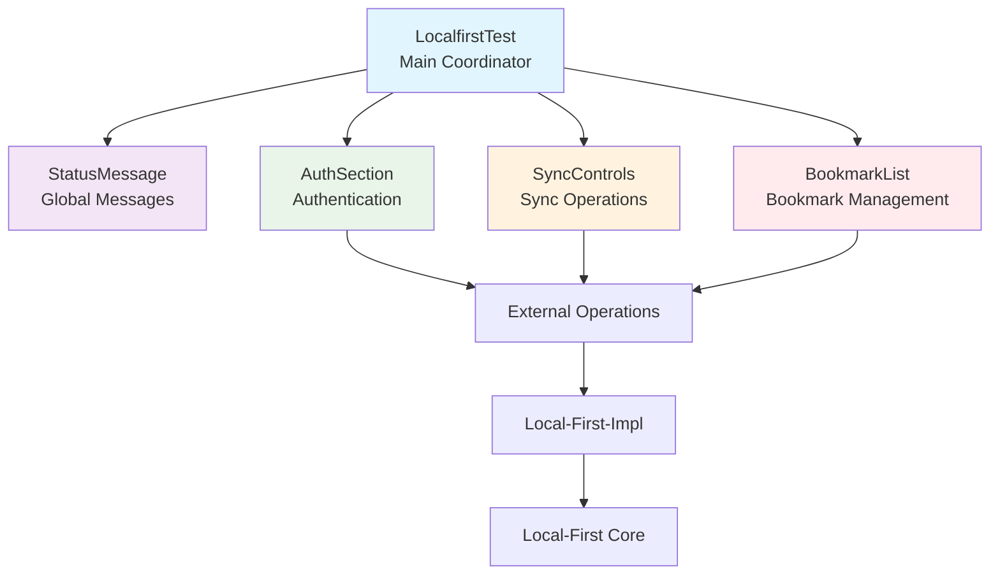

# Component Implementation Guide

## Component Architecture Overview

Our project uses an **independent section-based architecture** where each component manages its own state and operations completely independently. This approach eliminates the need for custom hooks and provides clear separation of concerns.

## Component Structure



## Component Details

### 1. LocalfirstTest (Main Coordinator)

**File**: `src/components/LocalfirstTest.tsx`  
**Size**: 66 lines (reduced from 562 lines)  
**Role**: Minimal coordination between sections

```typescript
function LocalfirstTest() {
  const [message, setMessage] = useState<string>('');
  const [currentUser, setCurrentUser] = useState<any>(null);
  const [bookmarkRefreshTrigger, setBookmarkRefreshTrigger] = useState<number>(0);

  // Coordinate user changes between sections
  const handleUserChange = (user: any) => {
    setCurrentUser(user);
    if (!user) {
      setBookmarkRefreshTrigger(prev => prev + 1);
    }
  };

  // Coordinate bookmark changes
  const handleBookmarkChange = () => {
    setBookmarkRefreshTrigger(prev => prev + 1);
  };

  return (
    <div style={{ /* layout styles */ }}>
      <StatusMessage message={message} />
      <AuthSection onUserChange={handleUserChange} onMessage={setMessage} />
      <SyncControls currentUser={currentUser} onMessage={setMessage} onBookmarkChange={handleBookmarkChange} />
      <BookmarkList currentUser={currentUser} onMessage={setMessage} refreshTrigger={bookmarkRefreshTrigger} />
    </div>
  );
}
```

**Key Features**:
- **Minimal State**: Only manages global coordination state
- **Callback-based Communication**: Uses callbacks to coordinate between sections
- **Trigger-based Updates**: Uses numeric triggers to signal refresh needs

### 2. AuthSection (Authentication Management)

**File**: `src/components/AuthSection.tsx`  
**Size**: 121 lines  
**Role**: Complete authentication lifecycle management

```typescript
export default function AuthSection({ onUserChange, onMessage }: AuthSectionProps) {
  const [currentUser, setCurrentUser] = useState<any>(null);
  const [isLoading, setIsLoading] = useState<boolean>(false);

  // Initialize authentication state
  useEffect(() => {
    loadCurrentUser();
  }, []);

  const handleLogin = async () => {
    setIsLoading(true);
    try {
      const user = await signInLegacy({
        email: 'weixu.craftsman@gmail.com',
        password: '123456'
      });
      setCurrentUser(user);
      onUserChange(user); // Notify parent
      onMessage(`✅ Login successful! Welcome ${user.email}`);
    } catch (error) {
      onMessage(`❌ Login failed: ${error.message}`);
    } finally {
      setIsLoading(false);
    }
  };
}
```

**Key Features**:
- **Self-contained Authentication**: Manages entire login/logout flow
- **Loading State Management**: Handles its own loading states
- **User Status Display**: Shows current user information
- **Parent Notification**: Uses callbacks to notify parent of user changes

### 3. SyncControls (Sync Operations Management)

**File**: `src/components/SyncControls.tsx`  
**Size**: 287 lines  
**Role**: Auto-sync engine and bookmark operations management

```typescript
export default function SyncControls({ currentUser, onMessage, onBookmarkChange }: SyncControlsProps) {
  const [isLoading, setIsLoading] = useState<boolean>(false);
  const [autoSyncEngine, setAutoSyncEngine] = useState<AutoSyncEngine | null>(null);
  const [autoSyncStatus, setAutoSyncStatus] = useState<AutoSyncStatus | null>(null);
  const [autoSyncEnabled, setAutoSyncEnabled] = useState<boolean>(false);

  // Initialize auto-sync engine
  useEffect(() => {
    initializeAutoSync();
    return () => {
      if (autoSyncEngine) {
        autoSyncEngine.cleanup();
      }
    };
  }, []);

  const initializeAutoSync = async () => {
    const configManager = new ConfigurationManager({
      tableName: 'bookmarks',
      storageKeyPrefix: 'mateme_autosync'
    });
    
    const engine = new AutoSyncEngine(configManager);
    
    const statusListener = (status: AutoSyncStatus) => {
      setAutoSyncStatus(status);
      setAutoSyncEnabled(status.enabled);
      
      // Refresh bookmarks when sync completes
      if (!status.isRunning && status.queueSize === 0 && status.lastSync) {
        setTimeout(() => onBookmarkChange(), 500);
      }
    };
    
    engine.addStatusListener(statusListener);
    await engine.initialize();
    setAutoSyncEngine(engine);
  };
}
```

**Key Features**:
- **Auto-sync Engine Management**: Complete lifecycle management
- **Bookmark Operations**: Add bookmark functionality
- **Sync Status Display**: Real-time sync status monitoring
- **User Context Awareness**: Enables/disables sync based on authentication

### 4. BookmarkList (Bookmark Display Management)

**File**: `src/components/BookmarkList.tsx`  
**Size**: 220 lines  
**Role**: Bookmark display, deletion, and refresh management

```typescript
export default function BookmarkList({ currentUser, onMessage, refreshTrigger }: BookmarkListProps) {
  const [bookmarks, setBookmarks] = useState<Bookmark[]>([]);
  const [isLoading, setIsLoading] = useState<boolean>(false);

  // React to user changes and refresh triggers
  useEffect(() => {
    if (currentUser) {
      loadBookmarks();
    } else {
      setBookmarks([]);
    }
  }, [currentUser, refreshTrigger]);

  const loadBookmarks = async () => {
    try {
      const user = await getCurrentUserLegacy();
      if (user) {
        const bookmarksResult = await Effect.runPromise(getBookmarks({ user_id: user.id }));
        setBookmarks(bookmarksResult);
      }
    } catch (error) {
      console.log('Failed to load bookmarks:', error);
    }
  };

  const handleDeleteBookmark = async (bookmarkId: string, bookmarkTitle: string) => {
    setIsLoading(true);
    try {
      await Effect.runPromise(deleteBookmark(bookmarkId));
      onMessage(`✅ Bookmark deleted: ${bookmarkTitle}`);
      await loadBookmarks(); // Refresh list
    } catch (error) {
      onMessage(`❌ Delete failed: ${error.message}`);
    } finally {
      setIsLoading(false);
    }
  };
}
```

**Key Features**:
- **Trigger-based Refresh**: Responds to external refresh triggers
- **Self-managed Loading**: Handles bookmark loading and deletion
- **Responsive Design**: Optimized for sidebar layout
- **Manual Refresh**: Includes user-triggered refresh button

### 5. StatusMessage (Global Message Display)

**File**: `src/components/StatusMessage.tsx`  
**Size**: 17 lines  
**Role**: Simple global message display

```typescript
interface StatusMessageProps {
  message: string;
}

export default function StatusMessage({ message }: StatusMessageProps) {
  if (!message) return null;

  return (
    <div style={{
      padding: '12px',
      borderRadius: '4px',
      backgroundColor: message.includes('✅') ? '#d4edda' : '#f8d7da',
      color: message.includes('✅') ? '#155724' : '#721c24',
      border: `1px solid ${message.includes('✅') ? '#c3e6cb' : '#f5c6cb'}`,
      fontSize: '14px'
    }}>
      {message}
    </div>
  );
}
```

**Key Features**:
- **Conditional Rendering**: Only shows when message exists
- **Smart Styling**: Success/error styling based on message content
- **Lightweight**: Minimal implementation for focused responsibility

## Component Communication Patterns

### 1. Parent-to-Child Props
```typescript
// Main component passes data down
<AuthSection 
  onUserChange={handleUserChange}
  onMessage={setMessage}
/>
```

### 2. Child-to-Parent Callbacks
```typescript
// Child component notifies parent of changes
const handleLogin = async () => {
  const user = await signInLegacy(credentials);
  onUserChange(user); // Notify parent
  onMessage(`✅ Login successful!`); // Update global message
};
```

### 3. Trigger-based Updates
```typescript
// Parent uses numeric triggers to signal updates
const [refreshTrigger, setRefreshTrigger] = useState<number>(0);

const handleBookmarkChange = () => {
  setRefreshTrigger(prev => prev + 1); // Increment trigger
};

// Child responds to trigger changes
useEffect(() => {
  loadBookmarks();
}, [refreshTrigger]);
```

## External Integration Points

### 1. External Operations Integration
```typescript
// Components use high-level operations from external layer
import { createBookmark, getBookmarks, deleteBookmark } from '../externals/bookmark-operations';

const newBookmark = await Effect.runPromise(createBookmark(data));
```

### 2. Local-First-Impl Integration
```typescript
// Direct integration with implementation layer for specific needs
import { signInLegacy, signOutLegacy, getCurrentUserLegacy } from '../local-first-impl/auth/auth';

const user = await signInLegacy(credentials);
```

### 3. Auto-sync Integration
```typescript
// Integration with local-first core for sync management
import { AutoSyncEngine } from '../local-first/sync-engine';
import { ConfigurationManager } from '../local-first/sync-engine/config';

const engine = new AutoSyncEngine(configManager);
```

## Design Principles

### 1. **Independence**
Each component is completely self-contained and can operate independently.

### 2. **Single Responsibility**
Each component has one clear, focused responsibility.

### 3. **Minimal Coordination**
The main component only provides minimal coordination - no complex state management.

### 4. **Callback-based Communication**
Simple, predictable communication patterns using callbacks.

### 5. **Trigger-based Updates**
Efficient update mechanism using numeric triggers instead of complex state.

## Benefits

### 1. **Maintainability**
- Easy to understand and modify individual components
- Clear boundaries and responsibilities
- Simple debugging and testing

### 2. **Reusability**
- Components can be easily moved or reused
- No complex dependency chains
- Self-contained functionality

### 3. **Testability**
- Each component can be tested in isolation
- Simple mocking of callback functions
- Clear input/output boundaries

### 4. **Performance**
- Minimal re-renders due to focused state management
- Efficient trigger-based updates
- No unnecessary hook chains or complex dependencies

This architecture provides a clean, maintainable, and efficient approach to building complex UI applications with clear separation of concerns.