# Integration Flow Documentation

## Overview

This document illustrates how our Chrome Extension integrates with the local-first architecture, showing the complete data flow from UI interactions through the three architectural layers to external services.

## Complete Integration Flow


## Detailed Flow Examples

### 1. Authentication Flow

```mermaid
sequenceDiagram
    participant User
    participant AuthSection
    participant External as External Operations
    participant LFImpl as Local-First-Impl
    participant Supabase
    participant MainApp as LocalfirstTest
    participant SyncControls
    
    User->>AuthSection: Click Login Button
    AuthSection->>AuthSection: setIsLoading(true)
    AuthSection->>LFImpl: signInLegacy(credentials)
    
    LFImpl->>Supabase: authenticate user
    Supabase-->>LFImpl: user data + session
    LFImpl-->>AuthSection: authenticated user
    
    AuthSection->>AuthSection: setCurrentUser(user)
    AuthSection->>MainApp: onUserChange(user)
    AuthSection->>MainApp: onMessage("✅ Login successful!")
    
    MainApp->>MainApp: setCurrentUser(user)
    MainApp->>SyncControls: currentUser prop updated
    
    SyncControls->>SyncControls: enableAutoSyncForUser()
    Note over SyncControls: Auto-sync engine activates for authenticated user
```



### 2. Bookmark Creation Flow


### 3. Auto-Sync Detection Flow


## Integration Layer Details

### 1. Component → External Operations Integration

**Purpose**: High-level business operations abstraction

```typescript
// SyncControls.tsx
const handleAddBookmark = async () => {
  // Use high-level external operation
  const newBookmark = await Effect.runPromise(createBookmark({
    title: 'Sample Bookmark',
    link: 'https://example.com',
    summary: 'This is a sample bookmark',
    status: BookmarkStatus.ACTIVE,
    type: BookmarkType.BOOKMARK,
    user_id: currentUser.id,
    level: 0,
    sort_order: Date.now()
  }));
  
  onMessage(`✅ Bookmark added: ${newBookmark.title}`);
  onBookmarkChange(); // Trigger refresh
};
```

**Benefits**:
- Clean separation between UI and business logic
- Effect-based error handling
- Type-safe operations
- Consistent API across components

### 2. External Operations → Local-First-Impl Integration

**Purpose**: Delegate to concrete implementations

```typescript
// externals/bookmark-operations.ts
export const createBookmark = (data: BookmarkInput): Effect<Bookmark, BookmarkError> =>
  Effect.gen(function* () {
    // Get repository implementation
    const repository = yield* ChromeStorageRepository;
    
    // Delegate to implementation layer
    const bookmark = yield* repository.create({
      ...data,
      id: generateId(),
      created_at: new Date().toISOString(),
      updated_at: new Date().toISOString()
    });
    
    return bookmark;
  });
```

**Benefits**:
- Abstraction over storage implementations
- Consistent data transformation
- Centralized business rules
- Easy to swap implementations

### 3. Local-First-Impl → Local-First Core Integration

**Purpose**: Use core sync patterns and algorithms

```typescript
// local-first-impl/repositories/chrome-storage-repository.ts
import { performManualSync } from '../../local-first/manual-sync';
import { AutoSyncEngine } from '../../local-first/sync-engine';

export class ChromeStorageRepository {
  async create(data: BookmarkData): Promise<Bookmark> {
    // Store in Chrome storage
    await chrome.storage.local.set({ [data.id]: data });
    
    // Let auto-sync engine handle synchronization
    // (manual sync commented out for testing)
    
    return data as Bookmark;
  }
}
```

**Benefits**:
- Leverages battle-tested sync algorithms
- Handles complex conflict resolution
- Provides real-time synchronization
- Manages offline/online state transitions

### 4. Auto-Sync Engine Integration

**Purpose**: Automatic background synchronization

```typescript
// components/SyncControls.tsx
const initializeAutoSync = async () => {
  const configManager = new ConfigurationManager({
    tableName: 'bookmarks',
    storageKeyPrefix: 'mateme_autosync'
  });
  
  const engine = new AutoSyncEngine(configManager);
  
  // Listen for sync status changes
  const statusListener = (status: AutoSyncStatus) => {
    setAutoSyncStatus(status);
    setAutoSyncEnabled(status.enabled);
    
    // Refresh UI when sync completes
    if (!status.isRunning && status.queueSize === 0 && status.lastSync) {
      setTimeout(() => onBookmarkChange(), 500);
    }
  };
  
  engine.addStatusListener(statusListener);
  await engine.initialize();
  setAutoSyncEngine(engine);
};
```

**Key Features**:
- **Storage Change Detection**: Monitors Chrome storage for local changes
- **Remote Change Detection**: Subscribes to Supabase real-time updates
- **Conflict Resolution**: Handles simultaneous local/remote changes
- **Queue Management**: Batches and prioritizes sync operations
- **Status Reporting**: Provides real-time sync status to UI

## Data Transformation Flow

### 1. Input Data Transformation


### 2. Output Data Transformation


## Error Handling Flow


## Performance Considerations

### 1. Batched Operations
- Auto-sync uses 100ms batching window to reduce redundant operations
- Multiple rapid changes are grouped into single sync operation

### 2. Lazy Loading
- Bookmarks loaded only when needed
- Components initialize independently to reduce startup time

### 3. Optimistic Updates
- UI updates immediately for responsive experience
- Background sync handles eventual consistency

### 4. Efficient Change Detection
- Storage change detector filters out self-generated changes
- Remote change detector only processes relevant user data

## Testing Current Integration

The current implementation tests the effectiveness of auto-sync detectors by commenting out manual sync calls. This allows us to verify:

1. **Storage Change Detection**: Does the detector catch local bookmark operations?
2. **Sync Triggering**: Does auto-sync engine properly trigger sync operations?
3. **UI Updates**: Do components refresh properly after auto-sync completes?
4. **Error Handling**: How does the system behave when sync fails?

This testing approach validates that the local-first architecture can operate purely on automatic detection without explicit manual triggers, which would simplify the component integration and reduce coupling between UI and sync operations.

## Integration Benefits

### 1. **Loose Coupling**
Components interact through well-defined interfaces, making them easy to modify or replace.

### 2. **Local-First Principles**
Operations work offline and sync when connectivity is available.

### 3. **Resilient Architecture**
System continues to function even if individual layers experience issues.

### 4. **Scalable Design**
Easy to add new components, operations, or storage backends.

### 5. **Testable System**
Each integration point can be tested independently with clear boundaries.