# Project Architecture Documentation

## Overview

This Chrome Extension project implements a **local-first** bookmark management system with real-time synchronization capabilities. The architecture is organized into three main layers that work together to provide seamless offline-first functionality with cloud synchronization.

## Architecture Layers

```mermaid
graph TB
    subgraph "🎨 UI Components Layer"
        A[LocalfirstTest] --> B[AuthSection]
        A --> C[SyncControls] 
        A --> D[BookmarkList]
        A --> E[StatusMessage]
    end
    
    subgraph "🔧 External Operations Layer"
        F[bookmark-operations.ts]
        G[types.ts]
        H[config/]
    end
    
    subgraph "💾 Local-First Implementation Layer"
        I[local-first-impl/]
        I --> I1[auth/]
        I --> I2[repositories/]
        I --> I3[supabase-operations.ts]
    end
    
    subgraph "🌐 Local-First Core Layer"
        J[local-first/]
        J --> J1[manual-sync/]
        J --> J2[sync-engine/]
        J --> J3[simple-sync/]
        J --> J4[core/]
    end
    
    subgraph "☁️ External Services"
        K[Supabase Database]
        L[Chrome Storage API]
    end
    
    B --> F
    C --> F
    D --> F
    
    F --> I
    I --> J
    I --> K
    I --> L
    
    J --> K
    J --> L
    
    style A fill:#e1f5fe
    style F fill:#f3e5f5
    style I fill:#e8f5e8
    style J fill:#fff3e0
```



## Layer Details

### 1. 🎨 UI Components Layer

**Independent section-based architecture** - each component manages its own state and operations.

#### LocalfirstTest (Main Coordinator)
- **Role**: Orchestrates communication between sections
- **Responsibilities**: 
  - Global state coordination (user, messages)
  - Trigger-based refresh coordination
  - Layout and styling

#### AuthSection
- **Role**: Authentication management
- **Responsibilities**:
  - Login/logout operations
  - User state management
  - Authentication status display

#### SyncControls  
- **Role**: Sync operations and bookmark creation
- **Responsibilities**:
  - Auto-sync engine initialization and management
  - Bookmark creation
  - Manual sync triggers
  - Sync status monitoring

#### BookmarkList
- **Role**: Bookmark display and management
- **Responsibilities**:
  - Bookmark loading and display
  - Bookmark deletion
  - List refresh functionality

#### StatusMessage
- **Role**: Global message display
- **Responsibilities**:
  - Success/error message display
  - User feedback presentation

### 2. 🔧 External Operations Layer

This layer provides **high-level business operations** that abstract the complexity of local-first operations.

#### bookmark-operations.ts
```typescript
// High-level bookmark operations
export const createBookmark = (data: BookmarkInput) => Effect<Bookmark>
export const getBookmarks = (filter: BookmarkFilter) => Effect<Bookmark[]>  
export const deleteBookmark = (id: string) => Effect<void>
export const updateBookmark = (id: string, data: Partial<Bookmark>) => Effect<Bookmark>
```

#### types.ts
```typescript
// Business domain types
export interface Bookmark {
  id: string
  title: string
  link: string
  summary?: string
  status: BookmarkStatus
  type: BookmarkType
  user_id: string
  created_at: string
  updated_at: string
}

export enum BookmarkStatus { ACTIVE, ARCHIVED, DELETED }
export enum BookmarkType { BOOKMARK, FOLDER }
```

#### config/
- **bookmark-type-converters.ts**: Type conversion utilities
- **table-config.ts**: Database table configuration

### 3. 💾 Local-First Implementation Layer

This layer provides **concrete implementations** for local-first operations, connecting to actual storage systems.

#### auth/
- **auth.ts**: Authentication implementation with Supabase
- **errors.ts**: Authentication error types
- **index.ts**: Authentication exports

#### repositories/
- **chrome-storage-repository.ts**: Chrome extension storage implementation
- **chrome-storage-sync-repository.ts**: Chrome sync storage implementation  
- **schema-aware-supabase-repository.ts**: Supabase database implementation

#### supabase-operations.ts
Direct Supabase operations for remote storage

### 4. 🌐 Local-First Core Layer

This layer provides the **foundational local-first patterns** and sync algorithms (implementation details abstracted).

#### manual-sync/
Manual synchronization operations

#### sync-engine/
- **Auto-sync engine**: Automatic synchronization management
- **Configuration management**: Sync settings and preferences
- **Detectors**: Storage and remote change detection
- **Status management**: Sync state tracking

#### simple-sync/
Core synchronization algorithms and conflict resolution

## Data Flow

### 1. User Authentication Flow


### 2. Bookmark Creation Flow


### 3. Auto-Sync Detection Flow


## Key Integration Points

### 1. Component → External Operations
```typescript
// Components call high-level operations
const newBookmark = await Effect.runPromise(
  createBookmark({
    title: 'Sample Bookmark',
    link: 'https://example.com',
    user_id: currentUser.id
  })
)
```

### 2. External Operations → Local-First-Impl
```typescript
// External operations delegate to implementations
export const createBookmark = (data: BookmarkInput) =>
  Effect.gen(function* () {
    const repository = yield* ChromeStorageRepository
    return yield* repository.create(data)
  })
```

### 3. Local-First-Impl → Local-First Core
```typescript
// Implementation uses core sync patterns
import { performManualSync } from '../local-first/manual-sync'
import { AutoSyncEngine } from '../local-first/sync-engine'

// Auto-sync engine initialization
const engine = new AutoSyncEngine(configManager)
await engine.initialize()
```

## Sync Strategy

### Hybrid Approach
1. **Manual Sync**: Immediate sync after user operations (currently commented out for testing)
2. **Auto-Sync Detectors**: Background sync for other scenarios
   - **Storage Change Detector**: Monitors Chrome storage changes
   - **Remote Change Detector**: Monitors Supabase real-time changes
   - **Periodic Sync Detector**: Regular background sync

### Protection Mechanisms
- **Self-change filtering**: Prevents sync loops during operations
- **Batched processing**: Reduces redundant sync operations
- **Queue management**: Prevents duplicate sync requests
- **Graceful degradation**: Local operations work offline

## Benefits of This Architecture

### 1. **Separation of Concerns**
- UI logic separated from business logic
- Business operations abstracted from storage details
- Sync complexity hidden behind clean interfaces

### 2. **Local-First Principles**
- Operations work offline
- Immediate user feedback
- Eventual consistency with cloud storage
- Conflict resolution capabilities

### 3. **Maintainability**
- Each layer has clear responsibilities
- Easy to test individual components
- Simple to modify or extend functionality
- Clear data flow and dependencies

### 4. **Extensibility**
- Easy to add new bookmark operations
- Simple to support additional storage backends
- Straightforward to implement new UI components
- Flexible sync strategy configuration

## Testing Strategy

The current implementation includes testing for auto-sync effectiveness by temporarily disabling manual sync calls, allowing verification that the auto-sync detectors can handle synchronization automatically.

This architecture provides a robust, scalable foundation for local-first applications with real-time synchronization capabilities.