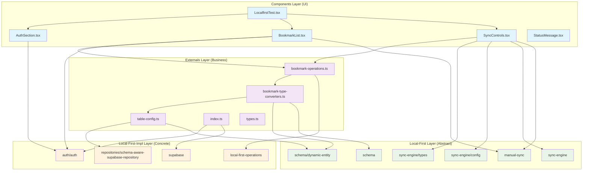
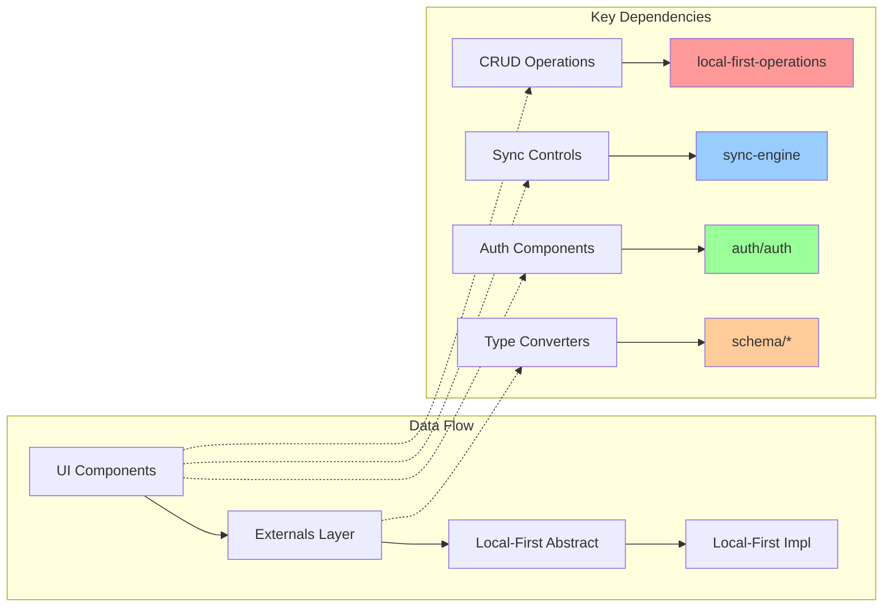
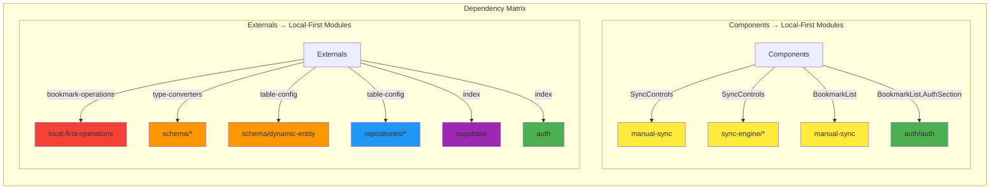
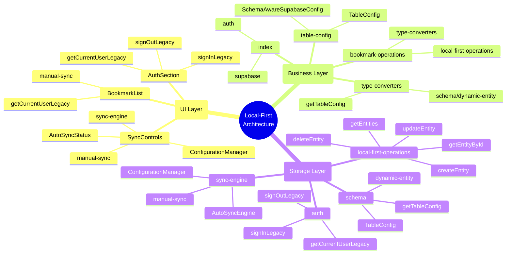
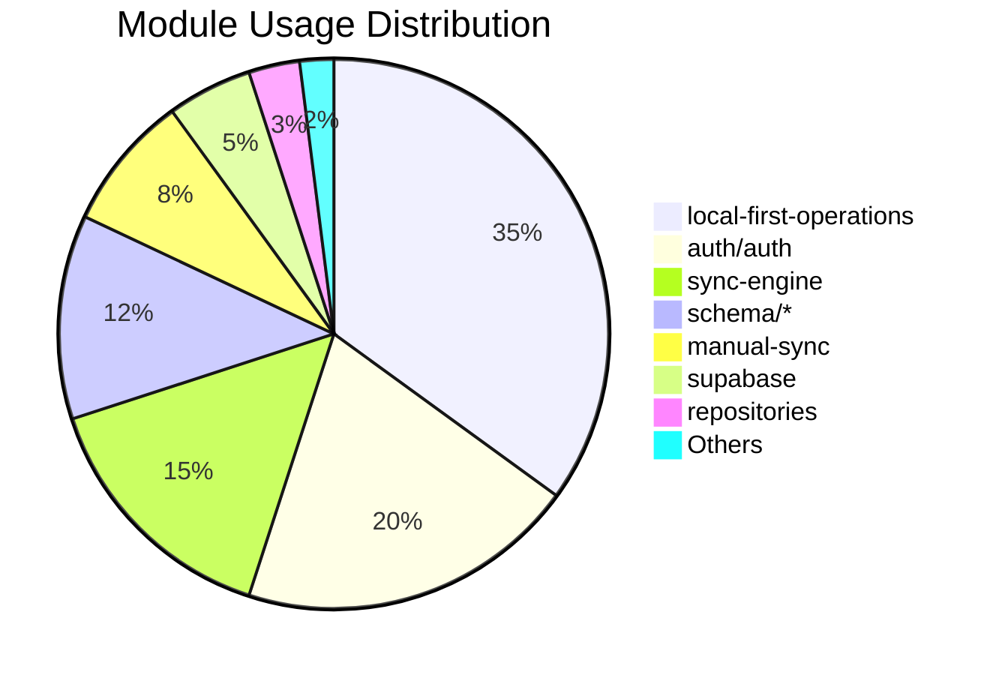

# Local-First 依赖分析报告

## 概述

本文档分析了 `components` 和 `externals` 目录中对 `local-first` 和 `local-first-impl` 模块的依赖关系，帮助开发者理解项目的架构层次和模块间的耦合关系。

## 依赖架构图

### 整体架构层次

```
Components Layer (UI 层)
    ↓ 依赖
Externals Layer (Business 业务层)  
    ↓ 依赖
Local-First Layer (Abstract 抽象层)
    ↓ 依赖  
Local-First-Impl Layer (Concrete 实现层)
```

### 详细依赖关系图



### 核心依赖流向图



## Components 目录依赖分析

### 1. SyncControls.tsx

**依赖模块：**
- `../local-first/manual-sync` → `performManualSync`
- `../local-first/sync-engine` → `AutoSyncEngine`
- `../local-first/sync-engine/config` → `ConfigurationManager`
- `../local-first/sync-engine/types` → `AutoSyncStatus` (类型)

**使用场景：**
- ✅ 执行手动同步操作（本地数据 → Supabase）
- ✅ 创建和管理自动同步引擎实例
- ✅ 配置同步引擎参数（表名、存储键前缀）
- ✅ 监听自动同步状态变化
- ✅ 控制自动同步的启用/禁用状态

**架构角色：** 同步控制中心，负责所有数据同步相关的 UI 操作

### 2. BookmarkList.tsx

**依赖模块：**
- `../local-first/manual-sync` → `performManualSync`
- `../local-first-impl/auth/auth` → `getCurrentUserLegacy`

**使用场景：**
- ✅ 删除书签后执行手动同步（注释状态，用于测试）
- ✅ 获取当前登录用户信息进行权限验证

**架构角色：** 书签列表展示，集成用户认证和数据同步

### 3. AuthSection.tsx

**依赖模块：**
- `../local-first-impl/auth/auth` → `signInLegacy`, `signOutLegacy`, `getCurrentUserLegacy`

**使用场景：**
- ✅ 处理用户登录操作（测试邮箱 + 密码）
- ✅ 处理用户登出操作
- ✅ 获取当前登录用户状态

**架构角色：** 用户认证管理中心

### 4. 其他组件

- **LocalfirstTest.tsx**: 无直接依赖，作为容器组件
- **StatusMessage.tsx**: 无依赖，纯 UI 组件

## Externals 目录依赖分析

### 1. bookmark-operations.ts

**依赖模块：**
- `../local-first-impl/local-first-operations` → `*` (命名空间导入)

**核心操作：**
```typescript
// CRUD 操作映射
LocalFirstOps.createEntity('bookmarks', data)     → createBookmark()
LocalFirstOps.getEntityById(uuid)                 → getBookmarkById()
LocalFirstOps.updateEntity(uuid, data)            → updateBookmark()
LocalFirstOps.deleteEntity(uuid)                  → deleteBookmark()
LocalFirstOps.permanentDeleteEntity(uuid)         → permanentDeleteBookmark()
LocalFirstOps.getEntities(options)                → getBookmarks()
```

**架构角色：** 业务层与存储层的适配器，将书签业务操作转换为通用实体操作

### 2. config/bookmark-type-converters.ts

**依赖模块：**
- `../../local-first/schema/dynamic-entity` → 通用实体类型
- `../../local-first/schema` → `getTableConfig`

**转换函数映射：**
```typescript
// 业务类型 ↔ 通用类型 双向转换
BookmarkCreateData    ↔ GenericEntityCreateData
BookmarkUpdateData    ↔ GenericEntityUpdateData  
BookmarkQueryOptions  ↔ GenericEntityQueryOptions
Bookmark             ↔ GenericEntityResult
Bookmark[]           ↔ GenericEntityResult[]
```

**架构角色：** 数据模型转换器，保持 local-first 引擎的业务无关性

### 3. config/table-config.ts

**依赖模块：**
- `../../local-first/schema/dynamic-entity` → `TableConfig`
- `../../local-first-impl/repositories/schema-aware-supabase-repository` → `SchemaAwareSupabaseConfig`

**配置内容：**
```typescript
// 字段映射：引擎字段名 → 数据库字段名
TABLE_CONFIG = {
  tableName: 'bookmarks',
  fields: {
    'id': 'uuid',
    'title': 'title',
    'url': 'link',
    'description': 'summary',
    // ...
  }
}
```

**架构角色：** 表结构配置中心，使引擎适配任意数据库表结构

### 4. index.ts

**依赖模块：**
- `../local-first-impl/supabase` → 重导出
- `../local-first-impl/auth` → 重导出

**架构角色：** 统一模块导出入口，简化外部导入路径

### 5. types.ts

**Local-First 相关：**
- 在 `metadata` 中设置 `local_first: true` 标记
- 标识数据来源于 local-first 存储系统

## 依赖统计总表

| 层级 | 文件 | Local-First 依赖 | Local-First-Impl 依赖 | 主要职责 |
|------|------|-----------------|----------------------|---------|
| **UI** | SyncControls.tsx | manual-sync, sync-engine/* | - | 同步控制 |
| **UI** | BookmarkList.tsx | manual-sync | auth/auth | 列表展示 + 认证 |
| **UI** | AuthSection.tsx | - | auth/auth | 用户认证 |
| **Business** | bookmark-operations.ts | - | local-first-operations | CRUD 适配 |
| **Business** | bookmark-type-converters.ts | schema/* | - | 类型转换 |
| **Business** | table-config.ts | schema/dynamic-entity | repositories/* | 配置管理 |
| **Business** | index.ts | - | supabase, auth | 模块聚合 |

## 架构设计原则

### ✅ 优秀设计特点

1. **清晰分层**: UI → Business → Abstract → Concrete
2. **职责分离**: 每个模块有明确的单一职责
3. **依赖方向正确**: 高层依赖低层，符合依赖倒置原则
4. **配置驱动**: 通过配置文件实现灵活性
5. **类型安全**: 完整的 TypeScript 类型定义

### 🔄 依赖流向

```
SyncControls.tsx ─┐
                  ├─→ local-first/sync-engine
BookmarkList.tsx ─┘

AuthSection.tsx ───→ local-first-impl/auth
BookmarkList.tsx ──→ local-first-impl/auth

bookmark-operations.ts ───→ local-first-impl/local-first-operations

bookmark-type-converters.ts ─→ local-first/schema
table-config.ts ──────────────→ local-first/schema + local-first-impl/repositories

index.ts ─────────────────────→ local-first-impl/*
```

### 📊 依赖矩阵图



### 🌐 模块网络拓扑图



## 核心依赖模块

### 🎯 最关键依赖

1. **local-first-impl/local-first-operations** - 核心存储引擎
2. **local-first/sync-engine** - 同步功能核心
3. **local-first-impl/auth/auth** - 用户认证核心
4. **local-first/schema** - 类型转换核心

### 📦 模块职责

| 模块路径 | 核心功能 | 被依赖程度 |
|----------|----------|------------|
| `local-first-impl/local-first-operations` | 统一存储接口 | ⭐⭐⭐⭐⭐ |
| `local-first/sync-engine` | 数据同步引擎 | ⭐⭐⭐⭐ |
| `local-first-impl/auth/auth` | 用户认证管理 | ⭐⭐⭐ |
| `local-first/schema` | 类型系统 | ⭐⭐⭐ |
| `local-first/manual-sync` | 手动同步 | ⭐⭐ |

### 🔥 依赖热力图

```mermaid
gitgraph
    commit id: "local-first-operations (Core Engine)"
    branch sync-features
    commit id: "sync-engine (Auto Sync)"
    commit id: "manual-sync (Manual Sync)"
    checkout main
    branch auth-system
    commit id: "auth/auth (Authentication)"
    checkout main
    branch type-system
    commit id: "schema/* (Type System)"
    commit id: "dynamic-entity (Generic Types)"
    checkout main
    branch storage-layer
    commit id: "repositories/* (Storage)"
    commit id: "supabase (Backend)"
    checkout main
    merge sync-features
    merge auth-system
    merge type-system
    merge storage-layer
    commit id: "Integrated System"
```

### 📈 模块使用频率分析



## 重构建议

### 🔧 可优化点

1. **减少直接依赖**: Components 可通过 Externals 间接使用 local-first
2. **统一认证接口**: 考虑在 Externals 层封装认证相关操作
3. **配置集中化**: 可考虑将所有配置统一管理
4. **类型定义优化**: 减少类型转换的复杂度

### 📈 扩展性考虑

- 新业务类型只需添加对应的 converter 和 operations
- 新存储后端只需实现 local-first-impl 接口
- 新同步策略可通过配置扩展 sync-engine

## 更新记录

- **2024-01-XX**: 初始版本，完成基础依赖分析
- **更新时间**: 每次架构调整后需更新此文档

---

## 📋 图表说明

### Mermaid 图表类型说明

1. **详细依赖关系图** (`graph TB`) - 显示所有模块的详细依赖关系，按层次分组
2. **核心依赖流向图** (`flowchart LR`) - 突出显示关键依赖路径和核心模块
3. **依赖矩阵图** (`graph LR`) - 按组件和外部模块分类显示依赖关系
4. **模块网络拓扑图** (`mindmap`) - 以思维导图形式展示整个架构的层次结构
5. **依赖热力图** (`gitgraph`) - 展示模块演进和集成过程
6. **模块使用频率分析** (`pie`) - 量化各模块的重要程度和使用频率

### 颜色编码

- 🔵 **蓝色**: UI 组件层 (Components)
- 🟣 **紫色**: 业务逻辑层 (Externals)  
- 🟢 **绿色**: 抽象接口层 (Local-First)
- 🟠 **橙色**: 具体实现层 (Local-First-Impl)

### 重要程度标识

- 🔴 **红色**: 核心存储引擎 (最关键)
- 🔵 **蓝色**: 同步功能 (重要)
- 🟢 **绿色**: 用户认证 (重要)
- 🟡 **黄色**: 类型系统 (基础)

---

**维护者**: Development Team  
**最后更新**: 2024-01-XX  
**文档版本**: v2.0 (Added Graphs)  
**图表工具**: Mermaid.js